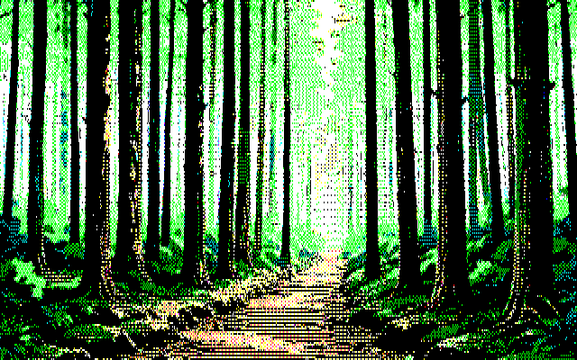

# Stride11 Fade

## これはなにをするものか

**PC-8801mkIISR で当時よく使われたフェード演出**を、キャプチャ動画1本から
リバースエンジニアリングし、いまの道具で再現できるようにしたものです。

画面を1バイト（横8ドット×1ライン）ずつ塗るとき、**アドレスを11バイト飛びに
書いていく**。開始位置を1つずつずらして11回くり返すと1プレーンが埋まり、
青・赤・緑の3プレーンぶん続けて絵が完成します。名前の `Stride11` はこの
「11バイト飛び（ストライド11）」から取っています。

見え方は2つの要素でできています。

- **斜めの織り目** … 1ライン下がるごとに横へずれるので、格子が斜めに走る
- **色の段取り** … 青だけの前半 → 赤が乗って紫へ → 緑が入って本来の色に着地

同じ演出を、連番PNG・After Effects・RPGツクールの3系統で使えるようにしてあります。

### 出力サンプル


**黒い画面から絵が立ち上がり、そのまま消えていくところ**です（640×400・86フレーム）。
前半は青プレーンだけなので、白くなるはずの領域が**真っ青な幽霊像**として現れます。
そこへ赤が乗って紫〜赤へ転び、最後に緑が入って本来の色に着地します。**この色の段取りが
演出の本体**で、単に透明度を上げていくフェードとは似ても似つかない見え方になります。

消えるほうは出現の**厳密な逆再生**です。最初に出たプレーンが最後に消えます。



**すでに表示されている背景の上に、絵だけを重ねて出すところ**です（640×400・43フレーム）。
背景の森は最初から最後までそのまま残り、立ち絵だけがプレーン順に立ち上がります。

ここが厄介なところで、**チャンネルごとに背景の透け具合が違う**状態（赤と緑は背景が
そのまま見えていて、青だけ絵が出ている）は、アルファ1本では表現できません。そのため
**乗算と加算の2枚に分けて**合成しています。塗っていないセルは完全に透明、塗り終わると
通常のアルファ合成と厳密に一致するので、**継ぎ目なく始まって継ぎ目なく終わります**。

どちらも格子は**画面全体**に張られています。絵をどこに置いても、織り目が画面と繋がって
見えるようにするためです。サンプルの絵自体も8色ディザで描いてあるので、当時の画面に
近い見え方になっています。

---

## 準備するもの

使いたいものによって違います。**どれもインストールは要りません。**

| 使いたい先 | 要るもの |
|---|---|
| 連番PNG が欲しい | ブラウザと画像2枚 |
| After Effects | AE とブラウザ（マップ書き出し用）、画像2枚 |
| RPGツクール（画面全体） | MV または MZ。`Stride11Fade.js` 1ファイルだけ |

---

## つかいかた

目的のフォルダの README を読んでください。どれも「これはなにをするものか →
準備するもの → つかいかた → 技術的な話」の順で書いてあります。

```
tools/
├── png-sequence/               連番PNG書き出し（ブラウザだけで動く）
├── ae/                         After Effects 用（日本語版UI）
├── ae-en/                      同・英語版UI
├── ae-transparent/             同・透明合成版（元画像を指定しない）
└── rpgmaker/                   画面全体にかけるプラグイン（MV / MZ）
```

### どれを使うか

| やりたいこと | 使うもの |
|---|---|
| 2枚の画像の間をフェードさせた連番が欲しい | `tools/png-sequence/` |
| AE の中で組みたい（背景は静止画） | `tools/ae/`（英語UIは `ae-en`） |
| AE の中で組みたい（背景が動画・後から変わる） | `tools/ae-transparent/` |
| ゲームの画面全体をフェードさせたい | `tools/rpgmaker/` |

### テスト

ツクールのプラグインは、本体の最小スタブを Node 上に組んで検証しています。
**合計 75 項目**です。

```bash
node tools/rpgmaker/test_args.js                              #  50
node tools/rpgmaker/test_mv_bridge.js                         #  25
```

ブラウザツール（`png-sequence` / `ae` / `ae-en`）は、
**ローカル HTTP サーバ経由で開いて**確認します。`file://` やエディタのプレビュー機能
では相対パスの `style.css` / `app.js` が解決できません。

```bash
python -m http.server 8734 --bind 127.0.0.1
```

---

## 技術的な話

### 演出の正体

**アドレスを11バイト飛びに書き込むインターリーブ × 11パス × 3プレーン。**

| | |
|---|---|
| 粒度 | **1バイト = 横8ドット × 縦1ライン**。1ドット単位ではない |
| 1パス | アドレスが11の倍数だけ離れたバイトを、画面の上から下へ順に書く |
| パス数 | 開始オフセットを `0,1,…,10` とずらして **11パス**で1プレーン完成 |
| プレーン順 | **青 → 赤 → 緑**（VRAM バンク 5CH / 5DH / 5EH）。完全に直列 |
| 速度 | 1パス 約43ms / 1プレーン 約480ms / **全体 約1.44秒** |

1ライン80バイト、`80 mod 11 = 3` なので、同じパスで塗られるバイトは
**1ライン下がるごとに24ドット右へずれます**。あの斜めの織り目の正体です。

そして**色の段取りが演出の本体**です。青プレーンだけの前半は、白くなるはずの領域が
真っ青な幽霊像として立ち上がり、赤が乗って紫〜赤へ転び、最後に緑で本来の色に着地します。

**解析そのもの（キャプチャ動画の分解と復元）は公開していません。** 素材が市販ソフトの
画面に由来するためです。ここに載せた数値と仕組みは、その解析から得られたものです。

### 動作確認の状況

| ツール | 状態 |
|---|---|
| `tools/png-sequence/` | 完成・検証済み |
| `tools/ae/` | 完成・**AE 26.2.1 日本語版で実機確認済み** |
| `tools/ae-en/` | 完成・**実機未検証**（確認できる環境が無いため、このまま置く） |
| `tools/ae-transparent/` | 完成・**AE 26.2.1 日本語版で実機確認済み** |
| `tools/rpgmaker/` | 完成・**MZ / MV とも実機確認済み** |

### ライセンスと権利について

- **解析に使った素材（画面録画、復元した画像、スナップショット）と、解析レポートは
  このリポジトリに含めていません。** 市販ソフトの画面に由来するためです。ツールの
  動作にはどれも必要ありません
- `tools/rpgmaker/Stride11Fade.js` と、それ以外の自作部分は MIT License です（[`LICENSE`](LICENSE)）。
  第三者の著作物に由来する部分だけは対象外で、その条件は `LICENSE` の「例外」に書いてあります

---
---

# Stride11 Fade

## What this is

A reverse-engineering of **a fade effect that was common on the PC-8801mkIISR**, worked
out from a single screen capture and rebuilt as tools you can use today.

The screen is painted one byte (8 dots wide, 1 line tall) at a time, and the writes
**step through memory 11 bytes apart**. Repeating that 11 times, each time starting one
byte later, fills one plane; doing the blue, red and green planes in turn completes the
picture. The name `Stride11` comes from that 11-byte stride.

Two things make the look:

- **A diagonal weave** — the pattern shifts sideways on every line down
- **A colour progression** — blue only at first, then red turning it purple, then green
  landing on the real colours

The same effect is available three ways: as a PNG sequence, inside After Effects, and as
RPG Maker plugins.

### Samples


**A picture rising out of a black screen and then leaving again** (640×400, 86 frames).
For the first third only the blue plane is painted, so everything destined to be white
rises as a **deep blue ghost**. Red then turns it purple and red, and green finally lands
it on its real colours. **That colour progression is the heart of the effect** — it looks
nothing like simply ramping up opacity.

The disappearance is the **exact reverse** of the appearance: the plane that arrived first
leaves last.


**A picture appearing on top of a background that is already on screen** (640×400, 43
frames). The forest stays exactly as it is from beginning to end while only the character
rises, plane by plane.

This is the awkward part: a state where **the background shows through by different
amounts per channel** — red and green still showing the forest while blue already shows
the picture — cannot be expressed with a single alpha channel. So the compositing is
split into **a multiply layer and an add layer**. Cells not yet painted are fully
transparent, and once painted the result matches ordinary alpha compositing exactly, so
it **starts and ends seamlessly**.

In both samples the lattice is anchored to **the whole screen**, so the weave stays
continuous with the screen wherever the artwork sits. The sample art itself is drawn with
8-colour dithering, which keeps the look close to the original hardware.

## What you need

It depends which one you want. **None of them need installing.**

| For | You need |
|---|---|
| A PNG sequence | A browser and two images |
| After Effects | AE, a browser (to export the map), and two images |
| RPG Maker (whole screen) | MV or MZ. Just `Stride11Fade.js` |

## How to use

Read the README in the folder you want. They all follow the same order: what it is,
what you need, how to use it, how it works.

```
tools/
├── png-sequence/               PNG sequence exporter (runs in a browser)
├── ae/                         After Effects (Japanese UI)
├── ae-en/                      the same, English UI
├── ae-transparent/             the same, transparent compositing (takes no base image)
└── rpgmaker/                   whole-screen plugin (MV / MZ)
```

### Which one

| What you want | Use |
|---|---|
| A sequence fading between two images | `tools/png-sequence/` |
| To build it in AE (still background) | `tools/ae/` (English UI: `ae-en`) |
| To build it in AE (video background, or one that changes later) | `tools/ae-transparent/` |
| To fade a game's whole screen | `tools/rpgmaker/` |

### Tests

The RPG Maker plugins are verified against minimal stubs of the engine under Node —
**75 checks in total**.

```bash
node tools/rpgmaker/test_args.js                              #  50
node tools/rpgmaker/test_mv_bridge.js                         #  25
```

The browser tools (`png-sequence` / `ae` / `ae-en`)
should be checked **through a local HTTP server**. Under `file://`, or an editor's preview
pane, the relative `style.css` and `app.js` may not resolve.

```bash
python -m http.server 8734 --bind 127.0.0.1
```

## How it works

### What the effect actually is

**Interleaved writes 11 bytes apart × 11 passes × 3 planes.**

| | |
|---|---|
| Unit | **one byte = 8 dots across, 1 line tall** — never a single dot |
| One pass | writes every byte whose address is a multiple of 11 apart, top to bottom |
| Passes | start offsets `0,1,…,10` — **11 passes** fill one plane |
| Plane order | **blue → red → green** (VRAM banks 5CH / 5DH / 5EH), strictly sequential |
| Speed | ~43 ms per pass, ~480 ms per plane, **~1.44 s total** |

With 80 bytes per line and `80 mod 11 = 3`, bytes painted in the same pass move
**24 dots to the right on every line down**. That is the diagonal weave.

And **the colour progression is the heart of it**: in the first third, everything destined
to be white rises as a deep blue ghost; red then turns it purple and red; green finally
lands it on the real colours.

**The analysis itself — taking the capture apart and reconstructing the picture — is
not published**, because the source material comes from a commercial product. The
figures and mechanics described here are its results.

### Verification status

| Tool | Status |
|---|---|
| `tools/png-sequence/` | Complete, verified |
| `tools/ae/` | Complete, **verified on AE 26.2.1 (Japanese)** |
| `tools/ae-en/` | Complete, **not verified on a real English install** (no environment to test it) |
| `tools/ae-transparent/` | Complete, **verified on AE 26.2.1 (Japanese)** |
| `tools/rpgmaker/` | Complete, **verified on both MZ and MV** |

### Licensing and rights

- **The material used for the analysis (the screen capture, the reconstructed images
  and the snapshots) and the analysis report are not in this repository**, because they
  come from the screen of a commercial product. None of the tools need them
- `tools/rpgmaker/Stride11Fade.js` and the other original work here are MIT licensed
  (see [`LICENSE`](LICENSE)). Parts derived from third-party material are excluded; the
  exception is spelled out in `LICENSE`
